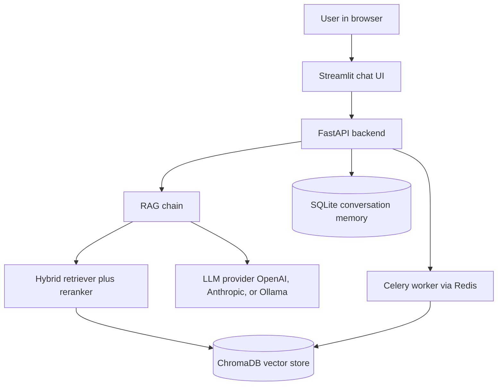

# RagFlow

**A retrieval augmented generation chatbot for question answering over your own documents.**

RagFlow lets you upload documents and ask questions about them. It retrieves the relevant passages, sends them to a language model as context, and returns a grounded answer while remembering the conversation. It runs on FastAPI with a Streamlit chat interface and packages the whole stack with Docker.

[](https://github.com/mlvpatel/RagFlow/actions/workflows/ci-cd.yml)   

## Features

| Area | Capability |
|---|---|
| Documents | PDF, DOCX, HTML, TXT, Markdown |
| Embeddings | Google text-embedding-004 |
| Retrieval | Dense ChromaDB search plus BM25, fused with Reciprocal Rank Fusion |
| Reranking | Cross encoder ms-marco-MiniLM-L-6-v2 on top of the fused results |
| Memory | Multi turn conversations stored in SQLite |
| Models | OpenAI, Anthropic, or local models via Ollama, chosen by model name |
| Async indexing | Celery worker backed by Redis, so uploads do not block |
| Security | API key auth, rate limiting, HTML input sanitization, CORS |
| Observability | Prometheus metrics at /metrics, structured logging, a health probe |
| Packaging | Docker Compose for the full stack, unit and integration tests, CI |

## Architecture



## How to use

### Docker Compose (recommended)

```bash
cp .env.example .env
# edit .env and set GOOGLE_API_KEY, one LLM key, and a value for API_KEY
docker compose -f docker/docker-compose.yml up --build -d
open http://localhost:8501      # the chat UI
# API docs at http://localhost:8000/docs
```

Then in the UI: upload a document in the sidebar, wait for it to index, and ask a question. The answer comes back grounded in your document, and follow up questions use the earlier conversation.

### Local development

```bash
make install                # install dependencies
cp .env.example .env         # fill in your keys
docker run -d -p 6379:6379 redis:7-alpine   # Redis for the worker
make dev                    # API at http://localhost:8000
make worker                 # Celery worker, in a second terminal
make frontend               # Streamlit at http://localhost:8501, in a third terminal
```

## Configuration

Settings come from environment variables (see `.env.example`).

| Variable | Required | Meaning |
|---|---|---|
| GOOGLE_API_KEY | yes | Google AI Studio key for embeddings |
| API_KEY | yes | Sent by clients in the X-API-Key header |
| OPENAI_API_KEY | optional | For GPT models |
| ANTHROPIC_API_KEY | optional | For Claude models |
| OLLAMA_BASE_URL | optional | For local models, default http://localhost:11434 |
| CHROMA_HOST | optional | Set to use a ChromaDB server, otherwise local persistence |

## API reference

| Method and path | Purpose |
|---|---|
| GET /health | Liveness probe, no auth |
| POST /v1/chat | Ask a question, grounded answer with memory |
| POST /v1/upload-doc | Upload and asynchronously index a document |
| GET /v1/list-docs | List indexed documents |
| POST /v1/delete-doc | Delete a document and its vectors |
| GET /v1/task/{task_id} | Status of an async indexing task |
| GET /metrics | Prometheus metrics |

## Tech stack

Python, FastAPI, Streamlit, LangChain, ChromaDB, SQLite, Celery, Redis, Prometheus, and Docker. Embeddings use Google text-embedding-004.

## Upgraded version

RagFlow is the baseline. An upgraded version, RagFlowPro, replaces ChromaDB with pgvector on Postgres, moves memory to Postgres, computes hybrid retrieval in a single SQL query, streams answers, and adds a measurable evaluation harness. See [github.com/mlvpatel/RagFlowPro](https://github.com/mlvpatel/RagFlowPro).

## License

Released under the MIT License. See [LICENSE](LICENSE). MIT is chosen because it is the simplest and most permissive common license, so anyone, including a client evaluating the work, can read, run, modify, and reuse the code with no friction.

## Author

Malav Patel. GitHub @mlvpatel.
